---


[](https://github.com/PyCQA/bandit)


# 1. Giới thiệu về Hệ thống ERP Quản lý Doanh nghiệp

Hệ thống ERP tích hợp được xây dựng trên nền tảng Odoo 15, bao gồm 4 module chính: **Nhân sự**, **Văn bản**, **Tài sản** và **Tài chính - Kế toán**, cung cấp các chức năng sau:

## Module Quản lý Nhân sự (`nhan_su`)
* Quản lý thông tin nhân viên, phòng ban, chức vụ
* Tự động ghi lịch sử công tác khi thay đổi phòng ban/chức vụ
* Tính toán tuổi tự động với validation nghiệp vụ

## Module Quản lý Văn bản (`quan_ly_van_ban`)
* Văn bản đi: Workflow 4 trạng thái (Nháp → Chờ duyệt → Đã duyệt → Phát hành)
* Văn bản đến: Quản lý xử lý với cảnh báo quá hạn tự động
* Phân loại độ khẩn, độ mật và tích hợp với nhân sự

## Module Quản lý Tài sản (`quan_ly_tai_san`)
* Dashboard tổng quan và tình hình mượn trả
* Quản lý loại tài sản và tài sản cụ thể
* Phân bổ tài sản cho các phòng ban
* Khấu hao tài sản (3 phương pháp: Tuyến tính/Giảm dần/Không)
* Kiểm kê tài sản theo phòng ban
* Luân chuyển tài sản giữa các phòng ban
* Thanh lý tài sản (bán/tiêu hủy)
* Quản lý đơn mượn tài sản & cấp phát tài sản
* Liên kết với văn bản đề xuất mua sắm

## Module Quản lý Tài chính - Kế toán (`quan_ly_tai_chinh`) ⭐ MỚI
* **Hệ thống kế toán**: 12 tài khoản VAS, sổ cái với validation cân bằng Nợ/Có
* **Quản lý lương**: Tự động tính BHXH/BHYT/BHTN, tự động tạo bút toán khi duyệt/chi trả
* **Kế toán tài sản**: Tự động tạo bút toán khi mua/khấu hao/thanh lý tài sản (Automation cấp 2)
* **Thu chi & Hóa đơn**: Phiếu thu/chi, hóa đơn bán/mua với liên kết bút toán
* **Dashboard & Báo cáo**: Biểu đồ real-time, báo cáo tài chính
* **Tích hợp AI**: Telegram Bot + Gemini AI hỗ trợ truy vấn tự nhiên
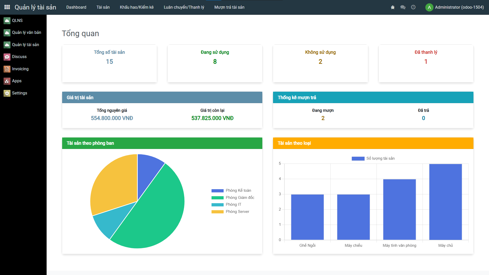
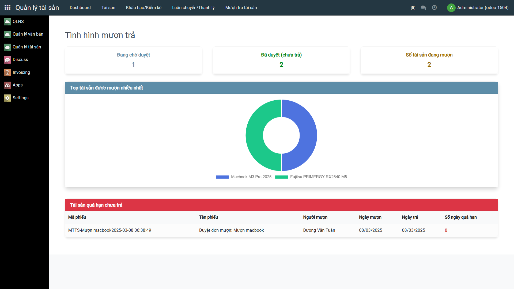
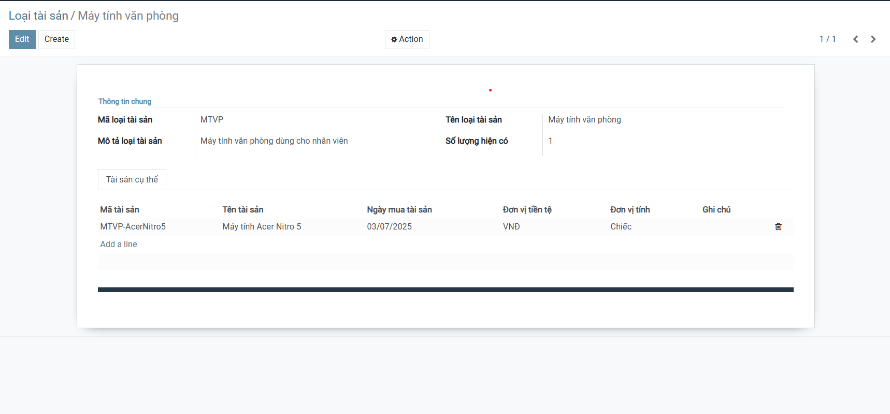
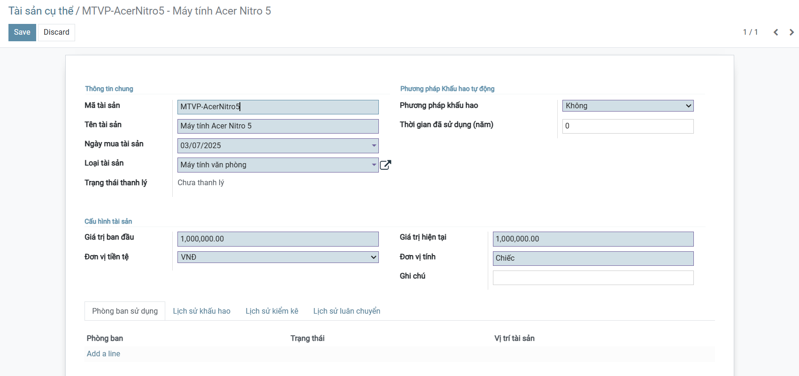
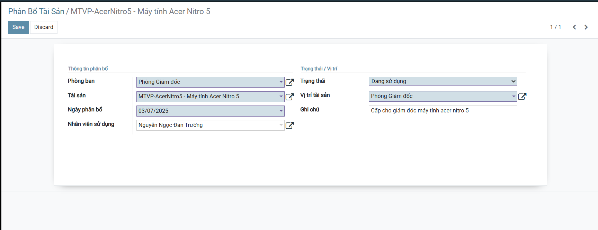
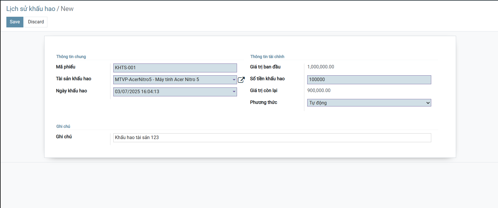
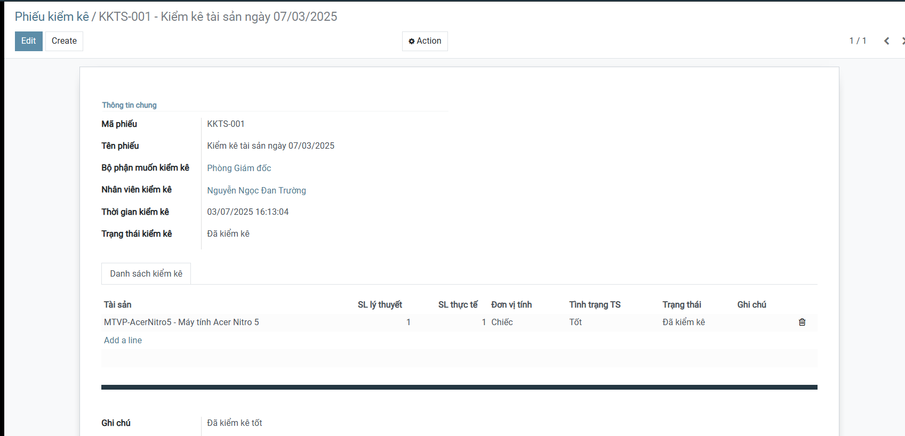
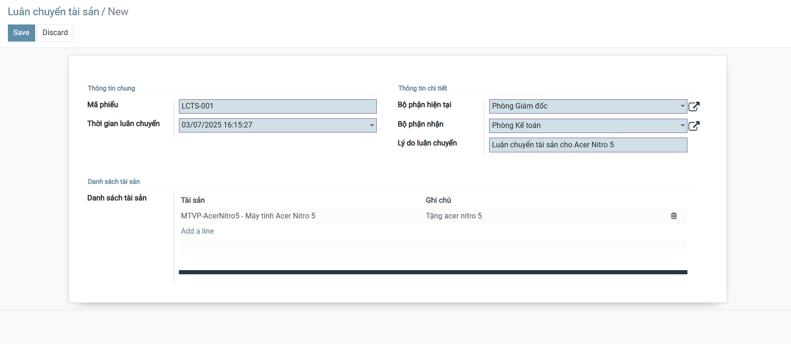
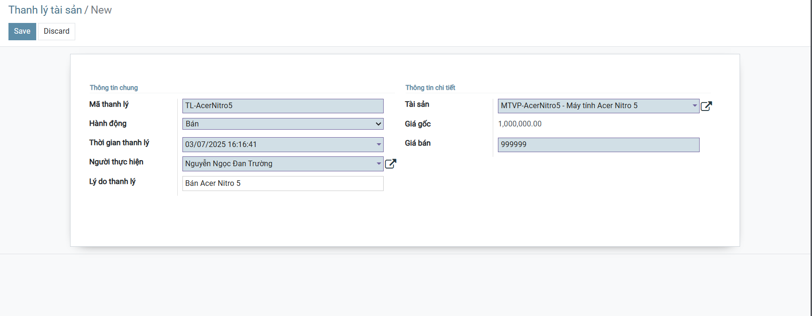
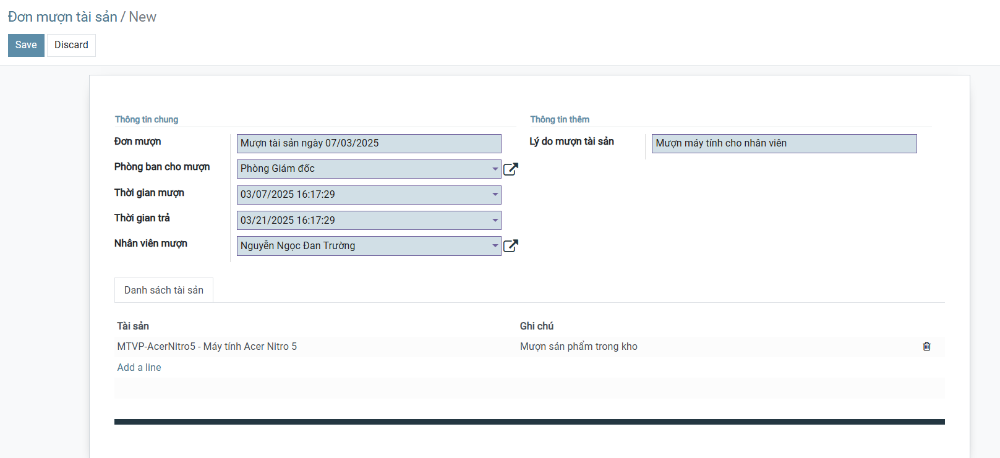
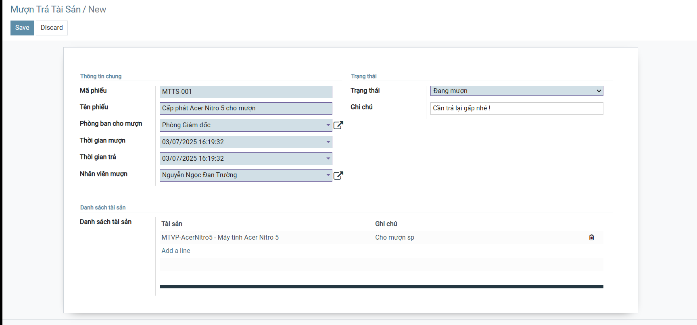

# 2. Cài đặt công cụ, môi trường và các thư viện cần thiết

## 2.1. Clone project

```bash
git clone https://github.com/dinhnghia204/TTDN-16-01-N5.git
cd TTDN-16-01-N5
```

## 2.2. Cài đặt các thư viện cần thiết

Người sử dụng thực thi các lệnh sau để cài đặt các thư viện cần thiết

```bash
sudo apt-get install libxml2-dev libxslt-dev libldap2-dev libsasl2-dev libssl-dev python3.10-distutils python3.10-dev build-essential libssl-dev libffi-dev zlib1g-dev python3.10-venv libpq-dev
```

## 2.3. Khởi tạo môi trường ảo

Thay đổi trình thông dịch sang môi trường ảo và chạy requirements.txt để cài đặt tiếp các thư viện được yêu cầu

```bash
python3.10 -m venv ./venv
```
```bash
source venv/bin/activate
```
```bash
pip3 install -r requirements.txt
```

# 3. Setup database

Khởi tạo database trên docker bằng việc thực thi file docker-compose.yml

```bash
sudo apt install docker-compose
```
```bash
sudo docker-compose up -d
```

# 4. Setup tham số chạy cho hệ thống

## 4.1. Khởi tạo odoo.conf

Tạo tệp **odoo.conf** có nội dung như sau:

```ini
[options]
addons_path = addons
db_host = localhost
db_password = odoo
db_user = odoo
db_port = 5434
xmlrpc_port = 8069
```

# 5. Chạy hệ thống và cài đặt các ứng dụng cần thiết

## 5.1. Thứ tự cài đặt modules

⚠️ **QUAN TRỌNG**: Các modules phải được cài đặt theo thứ tự phụ thuộc:

```
1. nhan_su            → Module nền tảng
2. quan_ly_van_ban    → Phụ thuộc: nhan_su
3. quan_ly_tai_san    → Phụ thuộc: nhan_su, quan_ly_van_ban
4. quan_ly_tai_chinh  → Phụ thuộc: tất cả các module trên
```

## 5.2. Lệnh chạy

**Cách 1: Cài đặt từng module theo thứ tự (Khuyến nghị)**
```bash
python3 odoo-bin.py -c odoo.conf -u nhan_su --stop-after-init
python3 odoo-bin.py -c odoo.conf -u quan_ly_van_ban --stop-after-init
python3 odoo-bin.py -c odoo.conf -u quan_ly_tai_san --stop-after-init
python3 odoo-bin.py -c odoo.conf -u quan_ly_tai_chinh --stop-after-init
```

**Cách 2: Cài đặt tất cả cùng lúc**
```bash
python3 odoo-bin.py -c odoo.conf -u nhan_su,quan_ly_van_ban,quan_ly_tai_san,quan_ly_tai_chinh
```

**Cách 3: Sử dụng script tiện ích**
```bash
chmod +x run.sh
./run.sh
```

Người sử dụng truy cập theo đường dẫn _http://localhost:8069/_ để đăng nhập vào hệ thống.

## 5.3. Kiểm tra modules đã cài đặt

Sau khi đăng nhập, vào menu **Settings → Apps** và kiểm tra:
- ✅ `nhan_su` - Quản lý Nhân sự
- ✅ `quan_ly_van_ban` - Quản lý Văn bản  
- ✅ `quan_ly_tai_san` - Quản lý Tài sản
- ✅ `quan_ly_tai_chinh` - Quản lý Tài chính/Kế toán

Hoàn tất

---

## 📚 Tài liệu tham khảo thêm

- **AI_ASSISTANT_GUIDE.md** - Hướng dẫn tích hợp AI
- **GEMINI_ASSISTANT_GUIDE.md** - Cấu hình Gemini AI
- **TELEGRAM_SETUP.md** - Thiết lập Telegram Bot
- **addons/quan_ly_tai_chinh/README.md** - Hướng dẫn chi tiết module tài chính
- **KICH_BAN_TEST.md** - Kịch bản test hệ thống

# 2. Cài đặt công cụ, môi trường và các thư viện cần thiết

## 2.1. Yêu cầu hệ thống

### **Phần cứng**
- RAM: Tối thiểu 4GB (khuyến nghị 8GB)
- Ổ cứng: Tối thiểu 10GB trống
- CPU: 2 cores trở lên

### **Phần mềm**
- **Hệ điều hành**: Ubuntu 22.04 LTS (hoặc tương đương)
- **Python**: 3.10+
- **PostgreSQL**: 13+ (chạy trên Docker)
- **Docker**: 20.10+
- **Docker Compose**: 1.29+

## 2.2. Clone project

```bash
git clone https://github.com/dinhnghia204/TTDN-16-01-N5.git
cd TTDN-16-01-N5
```

## 2.3. Cài đặt các thư viện hệ thống

Cài đặt các dependencies cần thiết cho Odoo:

```bash
sudo apt-get update
sudo apt-get install -y \
    libxml2-dev \
    libxslt-dev \
    libldap2-dev \
    libsasl2-dev \
    libssl-dev \
    python3.10-distutils \
    python3.10-dev \
    build-essential \
    libffi-dev \
    zlib1g-dev \
    python3.10-venv \
    libpq-dev
```

## 2.4. Khởi tạo môi trường ảo

Tạo và kích hoạt Python virtual environment:

```bash
python3.10 -m venv ./venv
source venv/bin/activate
```

Cài đặt các thư viện Python:

```bash
pip3 install --upgrade pip
pip3 install -r requirements.txt
```

# 3. Thiết lập Database

## 3.1. Cài đặt Docker và Docker Compose

```bash
# Cài đặt Docker
sudo apt install -y docker.io

# Cài đặt Docker Compose
sudo apt install -y docker-compose


```

## 3.2. Khởi động PostgreSQL container

Hệ thống sử dụng PostgreSQL 13 chạy trên Docker với cấu hình:
- **Host**: localhost
- **Port**: 5434 (tránh conflict với PostgreSQL local)
- **Database**: odoo
- **User**: odoo
- **Password**: odoo

```bash
# Khởi động container
sudo docker-compose up -d

# Kiểm tra container đang chạy
sudo docker ps

# Xem logs nếu có lỗi
sudo docker-compose logs -f
```

## 3.3. Kiểm tra kết nối database

```bash
# Kiểm tra kết nối
export PGPASSWORD=odoo
psql -h localhost -p 5434 -U odoo -d odoo -c "\dt"
```

# 4. Cấu hình hệ thống

## 4.1. Tạo file cấu hình odoo.conf

Sao chép từ template và chỉnh sửa nếu cần:

```bash
cp odoo.conf.template odoo.conf
```

Nội dung file `odoo.conf`:

```ini
[options]
addons_path = addons
db_host = localhost
db_password = odoo
db_user = odoo
db_port = 5434
xmlrpc_port = 8069
```

**Lưu ý**: File `odoo.conf` đã được thêm vào `.gitignore` để tránh commit thông tin nhạy cảm.

## 4.2. Cấu hình Telegram Bot (Tùy chọn)

Nếu muốn sử dụng tính năng Telegram Bot + AI:

1. Tạo bot trên [@BotFather](https://t.me/botfather)
2. Lấy API token
3. Lấy Gemini API key từ [Google AI Studio](https://makersuite.google.com/app/apikey)
4. Cập nhật vào database (xem hướng dẫn trong `TELEGRAM_SETUP.md`)

## 4.3. Script tiện ích

Hệ thống cung cấp các script sau:

- **`run.sh`**: Chạy Odoo ở chế độ development (auto-reload)
- **`run_all.sh`**: Chạy và nâng cấp tất cả modules
- **`test_modules.sh`**: Test từng module với timeout
- **`start_telegram_bot.sh`**: Khởi động Telegram Bot

# 5. Chạy hệ thống và cài đặt các module

## 5.1. Thứ tự cài đặt modules

⚠️ **QUAN TRỌNG**: Các modules phải được cài đặt theo thứ tự phụ thuộc:

```
1. nhan_su            (Module nền tảng)
2. quan_ly_van_ban    (Phụ thuộc: nhan_su)
3. quan_ly_tai_san    (Phụ thuộc: nhan_su, quan_ly_van_ban)
4. quan_ly_tai_chinh  (Phụ thuộc: tất cả các module trên)
```

## 5.2. Cài đặt lần đầu (Full setup)

### **Cách 1: Sử dụng script (Khuyến nghị)**

```bash
# Chạy script cài đặt tất cả
chmod +x run_all.sh
./run_all.sh
```

### **Cách 2: Cài đặt thủ công theo thứ tự**

```bash
# Bước 1: Cài đặt module Nhân sự
python3 odoo-bin.py -c odoo.conf -u nhan_su --stop-after-init

# Bước 2: Cài đặt module Văn bản
python3 odoo-bin.py -c odoo.conf -u quan_ly_van_ban --stop-after-init

# Bước 3: Cài đặt module Tài sản
python3 odoo-bin.py -c odoo.conf -u quan_ly_tai_san --stop-after-init

# Bước 4: Cài đặt module Tài chính
python3 odoo-bin.py -c odoo.conf -u quan_ly_tai_chinh --stop-after-init
```

### **Cách 3: Cài đặt tất cả cùng lúc**

```bash
python3 odoo-bin.py -c odoo.conf -u nhan_su,quan_ly_van_ban,quan_ly_tai_san,quan_ly_tai_chinh --stop-after-init
```

## 5.3. Chạy hệ thống ở chế độ development

```bash
# Sử dụng script (auto-reload khi code thay đổi)
chmod +x run.sh
./run.sh

# Hoặc chạy trực tiếp
python3 odoo-bin.py -c odoo.conf --dev=all
```

## 5.4. Chạy hệ thống ở chế độ production

```bash
python3 odoo-bin.py -c odoo.conf
```

## 5.5. Truy cập hệ thống

1. Mở trình duyệt và truy cập: **http://localhost:8069**
2. Đăng nhập với thông tin:
   - **Database**: `odoo`
   - **Email**: `admin`
   - **Password**: `admin` (hoặc password bạn đã đặt khi tạo database)

## 5.6. Kiểm tra modules đã cài đặt

1. Vào menu **Settings** (Cài đặt)
2. Chọn **Apps** (Ứng dụng)
3. Tìm kiếm và kiểm tra:
   - ✅ `nhan_su` - Quản lý Nhân sự
   - ✅ `quan_ly_van_ban` - Quản lý Văn bản
   - ✅ `quan_ly_tai_san` - Quản lý Tài sản
   - ✅ `quan_ly_tai_chinh` - Quản lý Tài chính/Kế toán

## 5.7. Test hệ thống

```bash
# Test từng module độc lập
chmod +x test_modules.sh
./test_modules.sh
```
    
